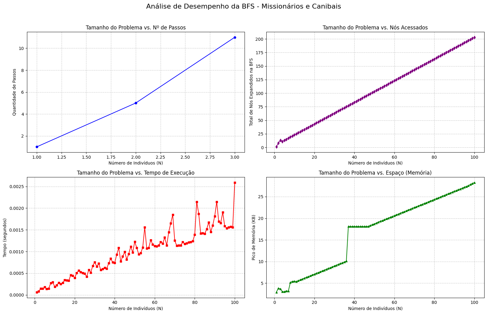

# k

Autor: Gabriel Stiegemeier
Disciplina: Inteligência Artificial
Professor: Luis Alvaro de Lima Silva
Data: 23/03/2026
***

## 1. Explicação e Formulação do Problema

O Problema dos Missionários e Canibais é um quebra-cabeça clássico na Inteligência Artificial, célebre por ter sido o foco do primeiro artigo que abordou a formulação de problemas de um ponto de vista puramente analítico, publicado por Amarel em 1968. O desafio consiste em transportar $N$ missionários e $N$ canibais de uma margem de um rio para a outra usando um barco com capacidade máxima para duas pessoas. A restrição fundamental, que confere complexidade ao problema, é que em nenhum momento o número de missionários pode ser estritamente menor que o número de canibais em qualquer uma das margens, sob pena de os missionários serem devorados.

Para que um agente inteligente possa encontrar a solução ótima, abstraímos os detalhes físicos irrelevantes e modelamos o cenário sob o paradigma de resolução de problemas por meio de busca. O problema fica matematicamente formalizado por cinco componentes:

* **Estado:** Adotamos uma representação atômica onde cada estado é uma "caixa-preta" indivisível para o algoritmo. Representamos um estado matematicamente pela tupla $(M_{esq}, C_{esq}, B_{esq})$, que indica a quantidade de missionários, canibais e barcos presentes na margem esquerda do rio.
* **Estado Inicial:** O problema começa com todas as entidades na margem de origem. Para o caso genérico de $N$ indivíduos, define-se como a tupla $(N, N, 1)$.
* **Teste de Objetivo:** Verifica se todos os indivíduos e o barco atravessaram o rio com sucesso, ou seja, alcançaram o estado $(0, 0, 0)$.
* **Ações e Filtro de Restrição:** A função `AÇÕES(s)` retorna as viagens válidas do barco $(m, c)$ obedecendo à capacidade da embarcação ($1 \le m+c \le 2$). Crucialmente, esta função atua como um filtro: ela só retorna ações que resultem em estados onde os missionários não estejam em desvantagem numérica em nenhuma das margens.
* **Modelo de Transição e Custo de Caminho:** A função `RESULTADO(s, a)` calcula a transição, subtraindo a tupla da ação da margem esquerda se o barco estiver indo, ou somando se estiver voltando. Cada travessia possui um custo de caminho unitário ($c=1$).

***

## 2. Por que resolver por estados? (Agentes Baseados em Objetivos)

Para compreender a escolha do algoritmo, é fundamental contrastar a nossa abordagem com a de um **agente reativo simples**. Agentes reativos selecionam suas ações baseando-se apenas na percepção do estado atual do mundo, guiando-se por regras de condição-ação diretas e ignorando o restante do histórico. Se tentássemos resolver o problema dos Missionários e Canibais com um agente reativo, ele fatalmente falharia. Como o objetivo final não pode ser alcançado em uma única travessia, tomar decisões isoladas baseadas apenas na margem atual faria o agente entrar em **laços de repetição infinitos** (como levar um missionário para a outra margem e imediatamente trazê-lo de volta) ou tomar ações que parecem seguras a curto prazo, mas que levam a um beco sem saída fatal logo em seguida.

A tomada de decisões complexa exige a consideração do futuro. Por isso, modelamos a solução utilizando um **agente de resolução de problemas**, que é um tipo de **agente baseado em objetivos**. Em vez de agir por reflexo, esse agente realiza um processo de busca, simulando mentalmente sequências de ações antes de executá-las no mundo real.

Para que isso seja computacionalmente viável, o ambiente do problema é mapeado em um **espaço de estados**. Graças ao fato de o nosso ambiente de tarefa ser **discreto, determinístico e conhecido**, sabemos exatamente qual será o estado resultante de cada ação. Dessa forma, o agente pode planejar, navegando de forma sistemática por esse espaço de estados até descobrir uma sequência fixa e segura de ações que o conduza do estado inicial ao estado objetivo.

***

## 3. Overview e explicação do código (Busca em Grafo)

A estratégia de resolução adotada para a exploração do espaço de estados fundamenta-se no algoritmo de **Busca em Largura** (*Breadth-First Search* - BFS) em sua variante de **Busca em Grafo**. É imperativo distinguir esta abordagem da **Busca em Árvore** tradicional. Enquanto a Busca em Árvore explora os caminhos possíveis sem reter memória dos estados já visitados, sua aplicação direta ao Problema dos Missionários e Canibais resultaria em ineficiência severa ou falha algorítmica. Isso ocorre devido à alta incidência de **caminhos redundantes** e **laços infinitos** inerentes ao modelo de transição do problema, como a movimentação repetitiva do barco de uma margem a outra transportando exatamente os mesmos passageiros indefinidamente. A Busca em Grafo resolve essa vulnerabilidade ao memorizar o histórico de exploração, garantindo que o agente baseado em objetivos não reavalie ramificações já conhecidas.

Para viabilizar a Busca em Grafo de forma otimizada, o código desenvolvido recorre a duas estruturas de dados essenciais para o controle do fluxo algorítmico. A primeira é o **conjunto explorado**, instanciado através de uma tabela hash nativa do Python (a estrutura `set()`). Esta estrutura armazena todos os estados previamente processados, permitindo verificações de pertinência em tempo constante, denotado por $\mathcal{O}(1)$. A consulta imediata a este conjunto impede a expansão de estados já visitados, atuando como um filtro que quebra os ciclos no grafo e preserva os recursos de memória e processamento.

A segunda estrutura fundamental é a **borda** (ou fronteira), responsável por gerenciar os nós descobertos que aguardam expansão. Para garantir a característica fundamental da BFS, a borda foi implementada como uma fila **FIFO** (*First-In, First-Out*), valendo-se da coleção `deque` nativa do Python. O comportamento FIFO assegura que a exploração do espaço de estados ocorra estritamente nível por nível de profundidade. Consequentemente, ao processar os caminhos mais rasos primeiro e aplicar o teste de objetivo no momento da geração do nó, a arquitetura garante matematicamente a descoberta da **solução ótima**, atestando que o caminho retornado contém, obrigatoriamente, o menor número de travessias possíveis.

***

## 4. Avaliação dos Resultados

Para validar a eficiência e o comportamento do agente desenvolvido, a estratégia de **Busca em Largura** operando como uma **Busca em Grafo** foi submetida a testes empíricos escalando o número de indivíduos $N$ de $1$ até $100$. O desempenho do algoritmo foi analisado sob a ótica dos quatro critérios fundamentais de busca: Complitude, Otimização, Complexidade de Tempo e Complexidade de Espaço.

* **Complitude e Otimização (Tamanho do Problema vs. N° de Passos):** Como esperado teoricamente para a Busca em Largura em que o custo de cada passo é unitário, o algoritmo se provou **ótimo**, encontrando sempre o caminho mais curto para a solução. Os resultados mostram que o problema é solúvel apenas para $N \le 3$ (resolvido em 1, 5 e 11 passos, respectivamente). Para instâncias onde $N \ge 4$, a restrição de capacidade do barco ($c=2$) torna a travessia matematicamente impossível sem violar as regras de sobrevivência. Nesses casos, o algoritmo exaure o espaço de estados válido rapidamente e retorna a ausência de solução. Por explorar a malha de estados de forma sistemática e sem entrar em laços infinitos, o algoritmo demonstra ser **completo**, sendo capaz de garantir computacionalmente que o caminho não existe.

* **Complexidade de Tempo (Tamanho do Problema vs. Nós Acessados e Tempo de Execução):** O dado empírico mais revelador do experimento está no crescimento de nós gerados e expandidos. Embora a combinatória máxima teórica do problema sugira um espaço de estados polinomial de limite $\mathcal{O}(N^2)$, o gráfico de nós acessados revela uma taxa de crescimento estritamente linear, $\mathcal{O}(N)$. Isso ocorre porque o método de validação de estados (filtro de regras) atua podando maciçamente a árvore de possibilidades. Para que a restrição de sobrevivência seja obedecida em ambas as margens, a população deve transitar majoritariamente em configurações onde o número de missionários é igual ao de canibais ($M=C$), reduzindo o espaço explorável a um "corredor" linear estreito. Como o uso de um conjunto explorado garante que cada nó válido seja visitado no máximo uma vez, a complexidade de tempo prática se mantém linear. O gráfico de tempo de execução acompanha essa tendência (resolvendo $N=100$ em $\approx 0,0025$ segundos), apresentando apenas flutuações.

* **Complexidade de Espaço (Tamanho do Problema vs. Espaço/Memória):** O limite fatal da Busca em Largura clássica é o consumo de memória. No entanto, devido ao severo estrangulamento das ramificações válidas provocado pela "física" do problema (que restringe os estados acessíveis à proporção $\mathcal{O}(N)$), o armazenamento de nós na borda (fila) e no histórico de visitas (*closed list*) cresce apenas de forma linear. Um detalhe de implementação de hardware/software é capturado perfeitamente pelo gráfico de pico de memória: o salto abrupto observado na curva (como o ocorrido entre $N=36$ e $N=37$) reflete o comportamento interno da estrutura de Tabela Hash (`set` em Python) utilizada para o conjunto explorado. Para garantir inserções e buscas em tempo constante $\mathcal{O}(1)$, o interpretador Python realoca a tabela inteira e dobra o seu tamanho em blocos de memória contígua sempre que um determinado fator de carga (*load factor*) é atingido, justificando os platôs e os saltos degraus (*steps*) na memória consumida.
